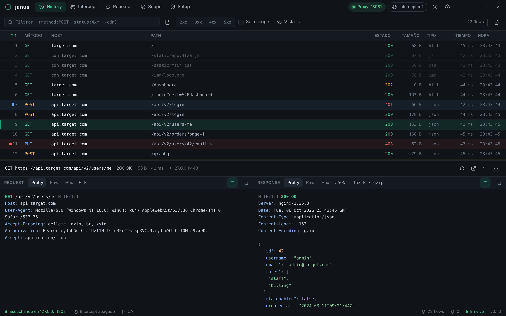
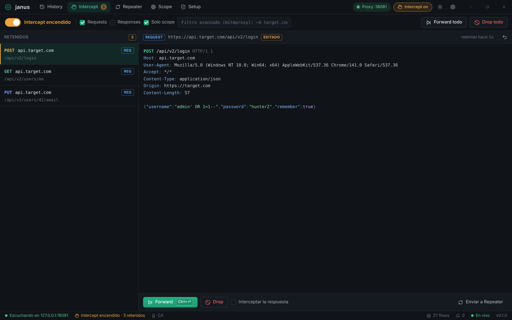
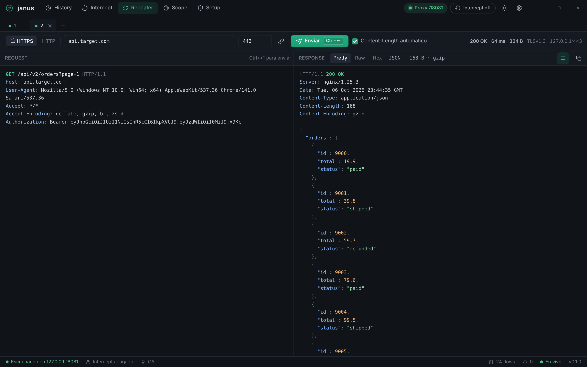
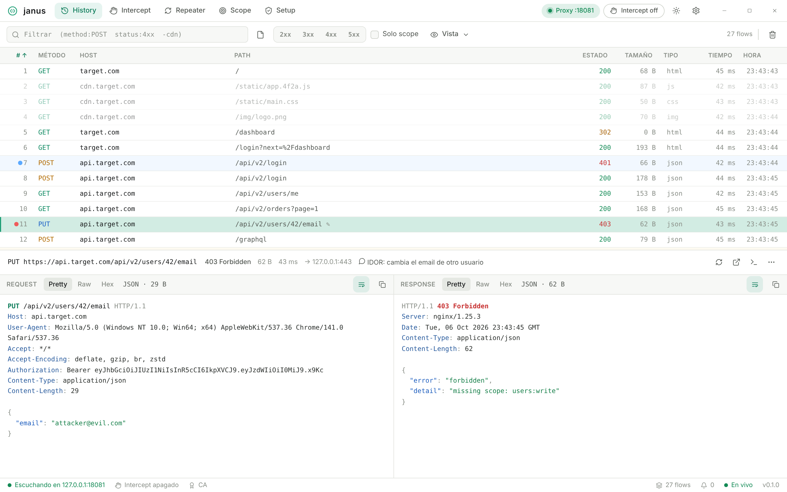

# Janus

Interceptor de tráfico HTTP/HTTPS self-hosted. Alternativa open source a Burp Suite / Caido, para pentesting y bug bounty.

**Stack:** backend Python + mitmproxy · frontend web (ES modules, sin build) · app nativa con Tauri 2 · Windows (principal) y Linux.

Arquitectura y decisiones en [`ARCHITECTURE.md`](./ARCHITECTURE.md).



| Intercept | Repeater | Tema claro |
| --- | --- | --- |
|  |  |  |

## Qué hace

| Vista | Para qué |
| --- | --- |
| **History** | Todo el tráfico en vivo, persistido en SQLite. Filtros (`method:POST status:4xx -cdn`), búsqueda en headers y cuerpos, colores, comentarios, visor Pretty / Raw / Hex, copiar como curl. |
| **Intercept** | Retiene requests y/o responses antes de que sigan: editarlos, Forward (`Ctrl+Enter`) o Drop. Filtro avanzado con la sintaxis de mitmproxy (`~d target.com & ~m POST`). |
| **Repeater** | Pestañas persistentes que mandan los bytes **tal cual** por socket/TLS (sirve para requests malformados), con Content-Length automático opcional. |
| **Scope** | Reglas include/exclude (`*.target.com`, `host:8443`, `target.com/api/*`). Lo excluido ni se descifra (ideal para apps con certificate pinning). |
| **Setup** | Navegador Janus (perfil aislado con el proxy y la CA ya puestos), instalación de la CA en Windows, proxy del sistema y guía para otras apps y celulares. |

## Instalar (Windows)

Descargá `Janus_0.1.0_x64-setup.exe` (artefacto del CI o build local, ver abajo) y ejecutalo. Se instala para tu usuario, sin permisos de administrador.

Al abrirlo, andá a **Setup** y elegí:

- **Abrir navegador Janus**: lo más rápido; no toca tu navegador normal.
- **Instalar en Windows** (la CA): para que cualquier app confíe en Janus. Windows pide confirmación; se instala solo para tu usuario.

> El instalador no está firmado: SmartScreen puede mostrar "Windows protegió su PC" → *Más información* → *Ejecutar de todas formas*.

## Desarrollo en Windows

Requisitos: Python 3.13+, Node 20+, [Rust](https://rustup.rs) (toolchain MSVC) y **Visual Studio Build Tools** con "Desarrollo para el escritorio con C++". WebView2 ya viene con Windows 11.

```powershell
npm install
py -3.14 -m venv backend\.venv
backend\.venv\Scripts\pip install -r backend\requirements-dev.txt
```

| Comando | Qué hace |
| --- | --- |
| `npm run backend:dev` | Backend desde el código + UI en una ventana de Edge (sin compilar Rust). |
| `npm run backend:build` | Congela el backend con PyInstaller → `src-tauri/binaries/janus-backend-<triple>.exe`. |
| `npm run dev` | App Tauri en modo desarrollo. Necesita el sidecar congelado (correr `backend:build` una vez); con `$env:JANUS_BACKEND_PYTHON="backend\.venv\Scripts\python.exe"` usa el backend desde el código. |
| `npm run build` | Sidecar + app + instalador → `src-tauri\target\release\bundle\nsis\Janus_0.1.0_x64-setup.exe`. |
| `backend\.venv\Scripts\python -m pytest backend\tests` | Tests (unitarios + end-to-end con proxy real). |
| `backend\.venv\Scripts\python scripts\smoke-sidecar.py` | Prueba el motor congelado como lo lanza Tauri (pipes, handshake, proxy y apagado). Correrlo después de `backend:build`. |

En Linux es igual, con `backend/.venv/bin/python` y las dependencias de sistema de Tauri (`libwebkit2gtk-4.1-dev`, etc.).

## Atajos

| Atajo | Acción |
| --- | --- |
| `Ctrl+1` … `Ctrl+5` | History · Intercept · Repeater · Scope · Setup |
| `Ctrl+I` | Prender/apagar intercept |
| `Ctrl+Enter` | Forward (Intercept) · Enviar (Repeater) |
| `Ctrl+R` | Mandar el flow seleccionado al Repeater |
| `Ctrl+F` | Filtrar el historial |
| `Ctrl+T` / `Ctrl+W` | Nueva / cerrar pestaña del Repeater |
| `Supr` | Borrar los flows seleccionados |
| `Ctrl+,` | Ajustes |

## Notas de Windows

- **Datos:** `%LOCALAPPDATA%\io.janus.app` (base `janus.sqlite3`, CA en `ca\`, perfiles del navegador Janus, logs). El programa se instala aparte, en `%LOCALAPPDATA%\Janus`; al desinstalar podés marcar "borrar datos de la aplicación".
- **CA:** se instala en *Raíz de confianza del usuario actual*. Para quitarla: Setup → *Quitar de Windows*.
- **Proxy del sistema:** se guarda la configuración previa y se restaura al apagarlo o al cerrar Janus. Si Janus se cerrara de golpe, se restaura en el próximo arranque.
- **Puerto ocupado o reservado:** si `8080` está en uso (o Hyper-V/WSL lo reservó — `netsh int ipv4 show excludedportrange protocol=tcp`), Janus lo avisa; cambialo en Ajustes, sin reiniciar.
- **`localhost`:** Janus resuelve `localhost` probando IPv4 e IPv6 en paralelo, así no se paga la demora de ~2 s que tiene Windows cuando el servidor local escucha solo en IPv4.

## Seguridad

La API de control escucha solo en `127.0.0.1`, en un puerto aleatorio, con un token de sesión que se entrega por el handshake con Tauri. Sin token → 401; `Host` ajeno → 400 (anti DNS-rebinding). El proxy escucha en `127.0.0.1:8080` salvo que elijas "Toda la red" en Ajustes. Detalle en `ARCHITECTURE.md` §8.
